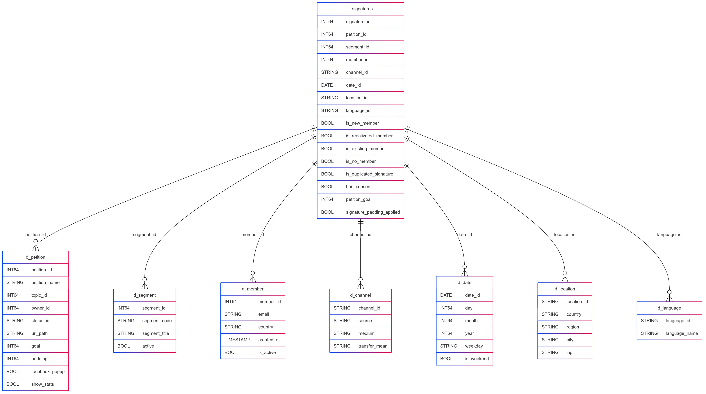

# Petitions & Signatures Bluebook – Dimensional Model Design (Draft)



> To define fact and dimension tables, we'll aim to answer the following four points:
> 1. Select the business process.  
> 2. Declare the grain.  
> 3. Identify the dimensions.  
> 4. Identify the facts.

## 1. Business Process

> Business processes are the operational activities performed by your organization,
> such as taking an order, processing an insurance claim, registering students for a
> class, or snapshotting every account each month. Business process events generate
> or capture performance metrics that translate into facts in a fact table. Most fact
> tables focus on the results of a single business process. Choosing the process is
> important because it defi nes a specifi c design target and allows the grain, dimensions, and facts to be declared. Each business process corresponds to a row in the
> enterprise data warehouse bus matrix.
> — Kimball & Ross, 2013, p. 39


**Selected process:** Recording of signatures on petition campaigns.  
Each signature represents a transactional event with relevant attributes for segmentation, impact analysis, and user-to-member conversion.

---

## 2. Declared Grain

> Declaring the grain is the pivotal step in a dimensional design. The grain establishes
> exactly what a single fact table row represents. The grain declaration becomes a binding contract on the design. The grain must be declared before choosing dimensions
> or facts because every candidate dimension or fact must be consistent with the grain.
> This consistency enforces a uniformity on all dimensional designs that is critical to
> BI application performance and ease of use. Atomic grain refers to the lowest level at
> which data is captured by a given business process. We strongly encourage you to start
> by focusing on atomic-grained data because it withstands the assault of unpredictable
> user queries; rolled-up summary grains are important for performance tuning, but they
> pre-suppose the business’s common questions. Each proposed fact table grain results
> in a separate physical table; diff erent grains must not be mixed in the same fact table.
> — Kimball & Ross, 2013, p. 39

**Declared grain:** One row per unique signature from a person on a petition.

- Lowest level (atomic): an individual signature.
- Identifier: `mysql_id` in the `signatures` table.
- Consistent with the `2_0_main_model.signatures` table.

---

## 3. Identified Dimensions

> Dimensions provide the “who, what, where, when, why, and how” context surrounding a business process event. Dimension tables contain the descriptive attributes
> used by BI applications for fi ltering and grouping the facts. With the grain of a fact
> table fi rmly in mind, all the possible dimensions can be identifi ed. Whenever possible, a dimension should be single valued when associated with a given fact row.
> Dimension tables are sometimes called the “soul” of the data warehouse because
> they contain the entry points and descriptive labels that enable the DW/BI system
> to be leveraged for business analysis. A disproportionate amount of eff ort is put
> into the data governance and development of dimension tables because they are
> the drivers of the user’s BI experience. 
> — Kimball & Ross, 2013, p. 40

| Dimension     | Description                                                | Main Source                                   |
|---------------|------------------------------------------------------------|------------------------------------------------|
| `d_campaign`  | Petition or campaign attributes                            | `2_0_main_model.petitions`                    |
| `d_segment`   | Target list or group associated with the petition          | `2_0_sources.mysql_segment`                   |
| `d_signer`    | Signer data (person who signed)                            | Derived from `signatures`                     |
| `d_channel`   | Medium, source, and transfer method                        | `signatures.source`, `medium`, `transfer_mean`|
| `d_date`      | Signature event date                                       | `signatures.created`, `transfer_timestamp`    |

> Note: `language` and `location` attributes are included in `d_signer`.

---

## 4. Identified Facts

> Facts are the measurements that result from a business process event and are almost
> always numeric. A single fact table row has a one-to-one relationship to a measurement
> event as described by the fact table’s grain. Thus a fact table corresponds to a physical observable event, and not to the demands of a particular report. Within a fact
> table, only facts consistent with the declared grain are allowed. For example, in a
> retail sales transaction, the quantity of a product sold and its extended price are
> good facts, whereas the store manager’s salary is disallowed. 
> — Kimball & Ross, 2013, p. 40

| Metric                      | Type     | Description                                                  |
|----------------------------|----------|--------------------------------------------------------------|
| `is_new_member`            | BOOL     | Whether the signature created a new member                   |
| `is_reactivated_member`    | BOOL     | Whether the signer was reactivated                           |
| `is_existing_member`       | BOOL     | Whether they were already an active member                   |
| `is_no_member`             | BOOL     | Whether they are not registered as a member                  |
| `is_duplicated_signature`  | BOOL     | Whether the signature was detected as duplicated             |
| `has_consent`              | BOOL     | Whether data usage consent was granted                       |

> Note: Metrics like `petition_goal` or `padding` belong to `d_campaign`, not the fact table.

---

## 5. Fact Table: `fact_signature_events`

Each row represents a unique signature, with foreign keys to its related dimensions.

---

## 6. Technical Considerations

- Dimensions use surrogate keys where necessary.
- `d_channel` can be simplified as a degenerate dimension if not expanded.
- Partitioning by `date_id` and clustering by `petition_id` or `segment_id` is recommended.

---

## 7. Dimensional Model

### General Architecture

- **Layer: `raw`** → Direct ingestion from sources (MySQL, Marketo, etc.).
- **Layer: `processed`** → Clean, normalized dimensional model.
- **Layer: `reporting`** → Aggregated fact tables, dashboard-ready.

---

### Fact Tables (`processed.fact_*`)

#### 1. `fact_signature_events`  
**Grain:** one unique signature per person, campaign, channel, and timestamp.

**Fields:**
- `signature_id`
- `petition_id`
- `signer_id`
- `segment_id`
- `channel_id`
- `signature_timestamp`
- `transfer_id`
- `transfer_mean`
- `new_member` (BOOLEAN)
- `existing_member` (BOOLEAN)
- `reactivated_member` (BOOLEAN)
- `no_member` (BOOLEAN)
- `duplicated_signature` (BOOLEAN)
- `new_lead` (BOOLEAN)
- `subscribe` (BOOLEAN)
- `allow_transfer` (BOOLEAN)
- `data_consent` (BOOLEAN)

---

### Dimension Tables (`processed.dim_*`)

#### 1. `dim_campaign`  
**Describes each campaign or petition.**
- `petition_id`
- `goal`
- `padding`
- `show_stats`
- `status_id`
- `segment_id`
- `topic_id`
- `owner_id`
- `petition_from_name`
- `petition_from_email`
- `petition_msg`
- `ty_msg`, `ty_mail_enabled`, `ty_from_name`, etc.
- `url_path`
- `transfer_timestamp`, `transfer_mean`

#### 2. `dim_signer`  
**Personal data of the signer.**
- `signer_id`
- `email`
- `first_name`, `last_name`
- `country`, `city`, `region`, `zip`
- `phone`, `address`
- `language`
- `id_card`
- `created`, `sent`
- `source`, `source_id`

#### 3. `dim_channel`  
**Channel through which the signature was received.**
- `channel_id`
- `medium`
- `source`
- `source_id`
- `transfer_mean`

#### 4. `dim_segment`  
**Campaign’s target segment.**
- `segment_id`
- `code`
- `title`
- `active`

#### 5. `dim_date`  
**Standard date table.**
- `date_id`
- `full_date`
- `day`, `month`, `year`
- `weekday`, `week_of_year`, etc.

---

### Final Reporting Table

#### `reporting.petitions_signatures_summary`

**Grain:** aggregated combination by channel, date, and campaign.  
**Source:** `processed.fact_signature_events` + joins with dimensions.

**Typical transformation:**
```sql
SELECT
  f.petition_id,
  d.date_id,
  c.channel_id,
  COUNTIF(f.new_member) AS new_members,
  COUNTIF(f.existing_member) AS existing_members,
  COUNTIF(f.reactivated_member) AS reactivated_members,
  COUNTIF(f.no_member) AS no_members,
  COUNTIF(f.duplicated_signature) AS duplicated_signatures,
  COUNTIF(f.new_lead) AS new_leads
FROM processed.fact_signature_events f
JOIN processed.dim_date d ON DATE(f.signature_timestamp) = d.full_date
JOIN processed.dim_channel c ON f.channel_id = c.channel_id
GROUP BY petition_id, date_id, channel_id
```

---

## 8. Suggested Next Steps

- Validate this structure against current Looker reports.
- Visually control the star schema.
- Prototype the schema in BigQuery.
- Integrate existing scheduled query logic.
- Document in the internal data catalog.

<!--
erDiagram
    fact_signature_events {
        int signature_id
        int petition_id
        int signer_id
        int segment_id
        int channel_id
        datetime signature_timestamp
        int transfer_id
        string transfer_mean
        boolean new_member
        boolean existing_member
        boolean reactivated_member
        boolean no_member
        boolean duplicated_signature
        boolean new_lead
        boolean subscribe
        boolean allow_transfer
        boolean data_consent
    }

    dim_campaign {
        int petition_id
        int goal
        int padding
        int show_stats
        string status_id
        int topic_id
        int segment_id
        int owner_id
        string petition_from_name
        string petition_from_email
        string petition_msg
        string ty_msg
        int ty_mail_enabled
        string ty_from_name
        string url_path
        timestamp transfer_timestamp
        string transfer_mean
    }

    dim_signer {
        int signer_id
        string email
        string first_name
        string last_name
        string address
        string city
        string region
        string country
        string zip
        string phone
        string id_card
        string language
        string source
        string source_id
        datetime created
        datetime sent
    }

    dim_channel {
        int channel_id
        string medium
        string source
        string source_id
        string transfer_mean
    }

    dim_segment {
        int segment_id
        string code
        string title
        int active
    }

    dim_date {
        int date_id
        date full_date
        int day
        int month
        int year
        string weekday
        int week_of_year
    }

    %% Relationships
    fact_signature_events ||--|| dim_campaign : petition_id
    fact_signature_events ||--|| dim_signer : signer_id
    fact_signature_events ||--|| dim_channel : channel_id
    fact_signature_events ||--|| dim_segment : segment_id
    fact_signature_events ||--|| dim_date : signature_timestamp
 -->